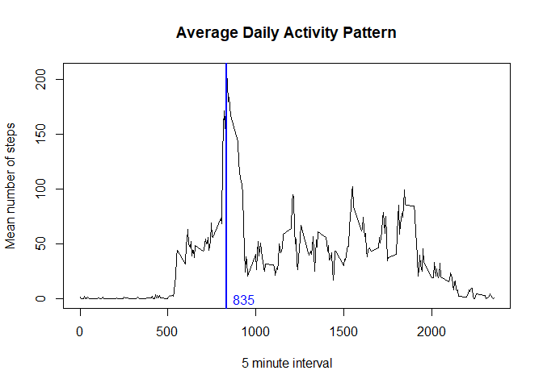
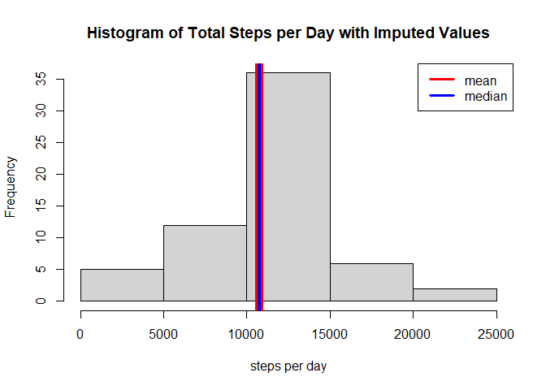

## Loading and preprocessing the data


```r
activity_data <- read.csv(unz('activity.zip','activity.csv'))
activity_data$date <- as.Date(activity_data$date, "%Y-%m-%d")
```

## What is mean total number of steps taken per day?


```r
total_per_day <- aggregate(activity_data$steps, by = list(activity_data$date), FUN = sum)
names(total_per_day) <- c("date", "steps")
hist(total_per_day$steps, xlab = "steps per day")
mean_per_day <- mean(total_per_day$steps, na.rm = TRUE)
median_per_day <- median(total_per_day$steps, na.rm = TRUE)
abline(v = mean_per_day, col = 'red', lwd = 10)
abline(v = median_per_day, col = 'blue', lwd = 4)
legend("topright", c("mean","median"), col = c("red","blue"), lwd = 3)
```

<!-- -->

The mean steps per day is 10766.  
The median steps per day is 10765.  

## What is the average daily activity pattern?


```r
mean_per_interval <- aggregate(activity_data$steps, 
                               by = list(activity_data$interval), FUN = mean, na.rm = TRUE)
names(mean_per_interval) <- c("interval", "steps")
plot(mean_per_interval$interval, mean_per_interval$steps, 
     type = "l", xlab = "5 minute interval", ylab = "Mean number of steps")
interval_with_max_mean_steps <- mean_per_interval$interval[which.max(mean_per_interval$steps)]
abline(v = interval_with_max_mean_steps, col = 'blue', lwd = 2)
text(interval_with_max_mean_steps+100, 0, interval_with_max_mean_steps, col = "blue")
```

<!-- -->

The maximum number of steps is in the 835th interval.


## Imputing missing values


The data will be filled in with the corresponding mean for that interval over all the days, as calculated per the previous section.


```r
total_na = sum(is.na(activity_data$steps))

for (idx in 1:nrow(activity_data)) {
  if (is.na(activity_data$steps[idx])) {
    activity_data$steps[idx] <- 
      mean_per_interval$steps[which(activity_data$interval[idx] == mean_per_interval$interval)]
  }
}

total_per_day <- aggregate(activity_data$steps, by = list(activity_data$date), FUN = sum)
names(total_per_day) <- c("date", "steps")
hist(total_per_day$steps, xlab = "steps per day")
mean_per_day <- mean(total_per_day$steps, na.rm = TRUE)
median_per_day <- median(total_per_day$steps, na.rm = TRUE)
abline(v = mean_per_day, col = 'red', lwd = 10)
abline(v = median_per_day, col = 'blue', lwd = 4)
legend("topright", c("mean","median"), col = c("red","blue"), lwd = 3)
```

<!-- -->

The total number of missing values in the dataset is 2304.

The new mean steps per day is 10766.  
The new median steps per day is 10766.  

These are similar to the previous values, with only a slight increase in the median.  
Overall, the frequency of the mean observations has increased, due to replacing the NA's with the means.

## Are there differences in activity patterns between weekdays and weekends?


```r
library(ggplot2)
activity_data$weekend <- factor(ifelse((weekdays(activity_data$date) 
                                        %in% c("Saturday", "Sunday")), "weekend", "weekday"))
mean_per_interval_weekend <- aggregate(activity_data$steps, 
                                       by = list(activity_data$interval, activity_data$weekend), 
                                       FUN = mean, na.rm = TRUE)
names(mean_per_interval_weekend) <- c("interval", "weekend", "steps")

qplot(interval, steps,
      data = mean_per_interval_weekend,
      facets = weekend ~ .,
      geom = "line", xlab = "5 minute interval", ylab = "Mean number of steps")
```

<!-- -->

The weekend data starts later in the day but is sustained at a higher more consistent level.
